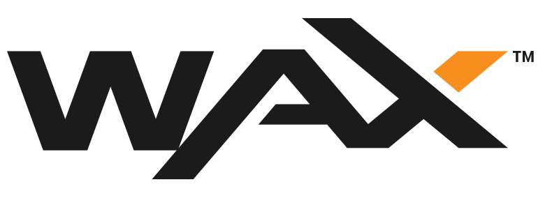

# WAX platform

&#x20;   WAX (The Worldwide Asset eXchange™) is the most used and transacted blockchain ecosystem in the world for NFTs, dApps and video games — providing the safest and most convenient way to create, buy, sell and trade both virtual and physical items to anyone, anywhere in the world.

For more information visit [WAX.io](https://on.wax.io/about-wax/clkn/https/wax.io/).

Create a [WAX Cloud Wallet](https://on.wax.io/about-wax/clkn/https/wallet.wax.io/) account.
