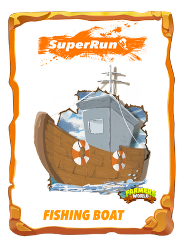

# Joints NFTs

In the newly launched card collection mode, every time you buy a map, the system will give you a random NFTs.

Users can contact customer service to exchange 10000WAX for each set of cards.

**Farmers World Joint NFTs**

   

   

| Name             | Rarity   | Probability |
| ---------------- | -------- | ----------- |
| Axe              | Common   | 26.54%      |
| Saw              | Uncommon | 8.84%       |
| Chainsaw         | Rare     | 0.88%       |
| Fishing Rod      | Common   | 26.54%      |
| Fishing Net      | Uncommon | 8.84%       |
| Fishing Boat     | Rare     | 0.88%       |
| Mining Excavator | Common   | 0.94%       |
| Stone Axe        | Common   | 26.54%      |
